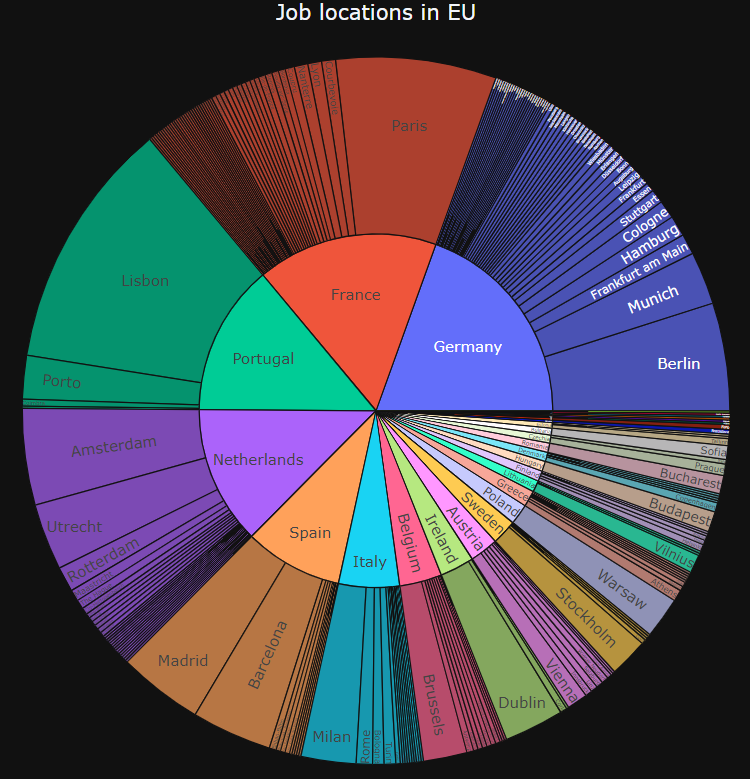

# LinkedIn job location scraper

This repository contains a set of scripts that will scrape a LinkedIn page for job offer locations, process the data, and visualize it. 

Executing _scrape_data.py_ will gather job offer locations from a personalized search of a LinkedIn page. Required arguments include username and password, and optional arguments, such as search keys and location, which have a default value but can be personalized. The results will be saved in the folder 'Data\Raw .txt files'. The execution of the script _process_data.py_ will process and clean all files in the previous directory, and save the results to 'Data\Processed .xlsx files'. Finally, the data can be visualized by executing _visualize_data.py_, which will produce Plotly sunburst plots for each file in the previous directory, and a scatter plot with the joined data from the processed files. The scatter plot also includes information about the [living + rent cost](https://www.numbeo.com/cost-of-living/rankings.jsp) and [average salary](https://www.numbeo.com/cost-of-living/region_prices_by_city?itemId=105&region=150) of each location (as of February 2021). Whether these plots should be shown and/or saved can be personalized while executing the script.

## Sample results:

1. Execute _scrape_data.py_ with the keyword 'Data Scientist' for each of the following locations: Austria, Denmark, France, Germany, Ireland, Italy, Netherlands, Portugal, and European Union.
2. Run _process_data.py_
3. Run _visualize_data.py_ with personalized parameters, to show and save the resulting plots (to 'Results' folder, as html)  
  This script also joins the processed job location files into one pandas DataFrame, which is visualized in the Scatter plot. To prevent duplicated job locations, this script automatically excludes the job locations from the European Union file, since all of the information in this file is also contained in the Country specified files. 

Of course, the Plotly plots can be interacted with. The following images are mere screenshots of some of the results:
  
  
  
### Scatter plot, displaying cities with at least 25 'Data Scientist' entry-level job offers: 
On the x-axis we have a cost of living + rent index, and on the y-axis the average salary. The size of the bubbles indicates the found quantity of jobs in the respective city.

  

 
 
          
### Sunburst plot for 'Data Scientist' entry-level job offers in the European Union: 

This plot shows the occurrence proportions in the job locations for each country/city. 

  

