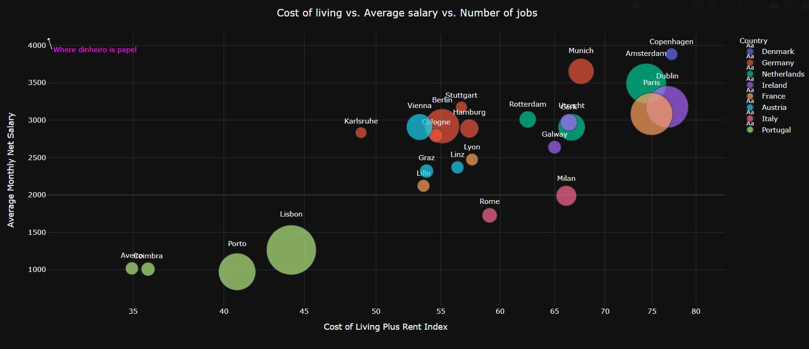

# LinkedIn job location scraper

This repositry contains a set of scripts that will scrape a LinkedIn page for job offer locations, process the data, and visualize it.

Executing _scrape_data.py_ will gather job offer locations from a personalized search of a LinkedIn page. Required arguments include username and password, search keys and location can be personalized. The results will be saved in a file called job_locations.txt, in the folder 'Data\Raw .txt files'. The execution of the script _process_data.py_ will process and clean the files in the previous directory, and save the results to 'Data\Processed .xlsx files'. Finally, the data can be visualized by executing _visualize_data.py_, which will produce Plotly sunburst plots for each file in the previous directory, and a scatter plot with the joined data from various searches with some extra information.

## Sample results:

1. Executed _scrape_data.py_ with keyword 'Data Scientist' for each of the following location: Austria, Denmark, France, Germany, Ireland, Italy, Netherlands, Portugal and European Union.
2. Ran _process_data.pt__
3. Ran _visualize_data.py_ with personalized parameters, in order to show and save the resulting plots (to 'Results' folder, as html) 

Sunburst plot for job offers in the European Union:

Scatter plot:

